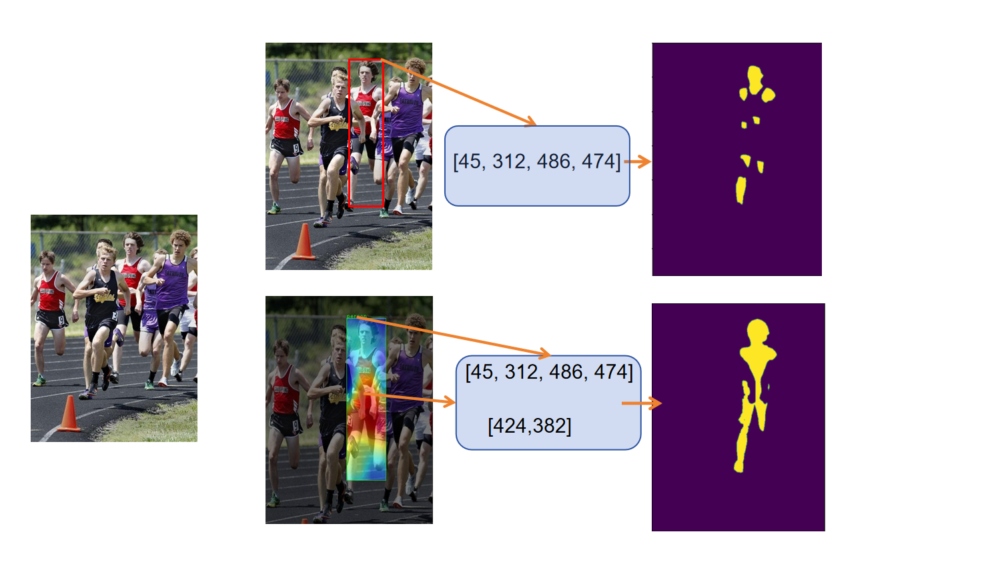

# GradCAM-guided SAM

## Introduction
In this project, we introduce a technique to improve the
precision of the SAM(Segment Anything Model). Previous
pipeline of SAM-based object segmentation leverage YOLO as 
prompt generator. However, single bounding box sometimes lead to
unintended segmentation results. We use GradCAM as an auxiliary
tool to generate accurate masks.

## How does it work
